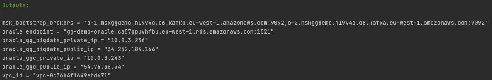
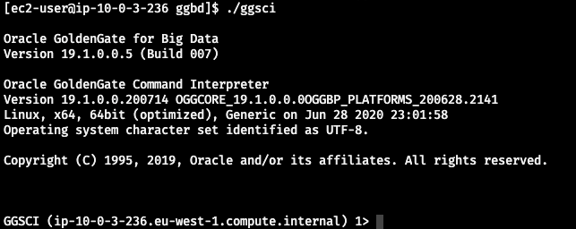
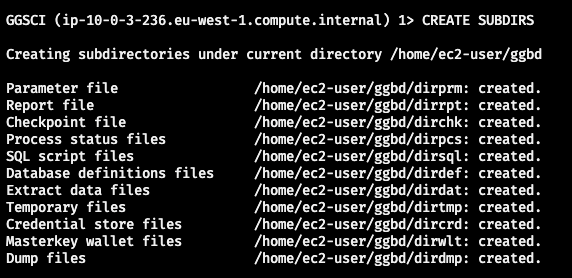
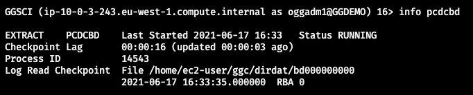

# Replicación de cambios unidireccional con Oracle GoldenGate for Big Data
Repositorio correspondiente al post de replicación unidireccional de datos a Kafka usando GoldenGate for Big Data


## Requisitos

Para poder ejecutar este ejemplo necesitas;

- Docker
- Credenciales de consola de un usuario de AWS con permiso para manejar EC2, RDS Oracle, MSK, VPC, Security Groups

<br/>

## Creando la infraestructura base

### Infraestructura en AWS

Para facilitar la “puesta en escena” del caso de uso vamos a usar el servicio de bases de datos gestionadas (RDS) para disponer de una base de datos Oracle y el servicio que proporciona un Kafka gestionado por AWS, llamado[ AWS MSK](https://aws.amazon.com/es/msk/)

En este caso de ejemplo, como queremos facilitar la conexión a los diferentes elementos directamente desde el PC local, hemos definido una VPC con una única subred pública y dotaremos a la base de datos de acceso público. En un sistema productivo, usaríamos redes privadas. 

A continuación vamos a detallar los pasos a seguir

<br/>

#### Generando la clave SSH

El script de Terraform necesita un par de claves para crear las instancias EC2 y nosotros usaremos la clave SSH posteriomente para conectarnos a las instancias. 

Por tanto, antes de lanzar el script de Terraform vamos a generar un par de claves ejecutando el siguiente comando desde la raíz del proyecto:

```bash
ssh-keygen -q -N "" -f iac/ssh/ssh_gg
```

Dentro del directorio “iac/ssh” se crearán dos ficheros correspondientes a las claves pública y privada.

<br/>

#### Creando la infraestructura con Terraform

Para ejecutar las acciones de creación y destrucción de la infraestructura nos vamos a apoyar en una imagen Docker que contiene Terraform y todo lo necesario para levantar la infraestructura. Solo necesitaremos las credenciales de AWS

El primer paso es construir la imagen a partir del Dockerfile. Para ello, desde la raíz del proyecto, lanzamos:

```bash
docker build . -t ogg_infra_builder
```

Después, lanzamos el contenedor y accedemos a él con el comando:

```
docker run -it --rm -e KEY_ID=<AWS_USER_KEY_ID> -e SECRET_ID=<AWS_SECRET_KEY_ID> -v $(pwd)/iac:/root/iac --entrypoint /bin/bash ogg_infra_builder
```

reemplazando 

- AWS_USER_KEY_ID: valor de la KEY del usuario de AWS
- AWS_SECRET_KEY_ID: valor de la SECRET del usuario de AWS

Después, ejecutamos dentro del contenedor el comando:

```
sh build.sh
```


Una vez ejecutado el script y creada la infraestructura, tendremos todo lo necesario para implementar el proceso de replicación. Como salida del script de Terraform, obtendremos algo parecido a lo siguiente:




<br/>

### Creando el modelo de datos inicial en Oracle

Una vez que tenemos la infraestructura creada y levantada, vamos a crear el modelo de datos en Oracle para poder partir del escenario inicial planteado en el caso de uso. Para conectarse a la base de datos podemos usar cualquier cliente compatible. Los datos de conexión son los siguientes:

- **Host**: valor de la variable de salida de Terraform "oracle_endpoint"
- **SID**: ggdemo
- **User/Passw**: oracledb / oracledb

Nos conectamos a la base de datos con nuestro cliente y lanzamos el siguiente script de SQL:

```sql
CREATE TABLE CUSTOMERS 
(
  ID NUMBER NOT NULL, 
  NIF VARCHAR2(9) NULL,
  CIF VARCHAR2(9) NULL,
  EMAIL VARCHAR2(255) NULL, 
  TELEFONO VARCHAR2(20) NOT NULL, 
  NOMBRE VARCHAR2(255) NULL,
  RAZONSOCIAL VARCHAR2(255) NULL,
  DESCRIPCION VARCHAR2(255) NULL,
  TIPO INTEGER NOT NULL,
  REPRESENTANTE VARCHAR2(255) NULL,
  CONSTRAINT CUSTOMERS_PK PRIMARY KEY (ID) ENABLE 
);

CREATE SEQUENCE CUSTOMERS_SEQ;

CREATE TRIGGER CUSTOMERS_TRG 
BEFORE INSERT ON CUSTOMERS 
FOR EACH ROW 
BEGIN
  <<COLUMN_SEQUENCES>>
  BEGIN
    IF INSERTING AND :NEW.ID IS NULL THEN
      SELECT CUSTOMERS_SEQ.NEXTVAL INTO :NEW.ID FROM SYS.DUAL;
    END IF;
  END COLUMN_SEQUENCES;
END;
/

INSERT INTO CUSTOMERS (NIF, EMAIL, TELEFONO, NOMBRE, TIPO) VALUES ('11111111H', 'test1@email.com', '111111111', 'test1', 1);
INSERT INTO CUSTOMERS (NIF, EMAIL, TELEFONO, NOMBRE, TIPO) VALUES ('22222222H', 'test2@email.com', '222222222', 'test2', 1);
INSERT INTO CUSTOMERS (NIF, EMAIL, TELEFONO, NOMBRE, TIPO) VALUES ('33333333H', 'test3@email.com', '333333333', 'test3', 1);
INSERT INTO CUSTOMERS (NIF, EMAIL, TELEFONO, NOMBRE, TIPO) VALUES ('44444444H', 'test4@email.com', '444444444', 'test4', 1);
INSERT INTO CUSTOMERS (NIF, EMAIL, TELEFONO, NOMBRE, TIPO) VALUES ('55555555H', 'test5@email.com', '555555555', 'test5', 1);
INSERT INTO CUSTOMERS (CIF, EMAIL, TELEFONO, RAZONSOCIAL, TIPO) VALUES ('B76365789', 'test6@email.com', '666666666', 'Empresa 1', 2);
INSERT INTO CUSTOMERS (CIF, EMAIL, TELEFONO, RAZONSOCIAL, TIPO) VALUES ('C76462739', 'test7@email.com', '777777777', 'Empresa 2', 2);
INSERT INTO CUSTOMERS (CIF, EMAIL, TELEFONO, RAZONSOCIAL, TIPO) VALUES ('J73422331', 'test8@email.com', '888888888', 'Empresa 3', 2);
COMMIT;
```

<br/>

## Preparando la base de datos para replicación

Para que el proceso de replicación sea posible necesitamos configurar la base de datos Oracle. Para ello, lanzamos las siguientes sentencias SQL contra la base de datos Oracle:

```
ALTER TABLE CUSTOMERS ADD SUPPLEMENTAL LOG DATA (ALL) COLUMNS;

exec rdsadmin.rdsadmin_util.set_configuration('archivelog retention hours',24);

CREATE TABLESPACE administrator;
CREATE USER oggadm1 IDENTIFIED BY "oggadm1" DEFAULT TABLESPACE ADMINISTRATOR TEMPORARY TABLESPACE TEMP;
alter user oggadm1 quota unlimited on ADMINISTRATOR;
GRANT UNLIMITED TABLESPACE TO oggadm1;


GRANT CREATE SESSION, ALTER SESSION TO oggadm1;
GRANT RESOURCE TO oggadm1;
GRANT SELECT ANY DICTIONARY TO oggadm1;
GRANT FLASHBACK ANY TABLE TO oggadm1;
GRANT SELECT ANY TABLE TO oggadm1;
GRANT INSERT ANY TABLE TO oggadm1;
GRANT UPDATE ANY TABLE TO oggadm1;
GRANT DELETE ANY TABLE TO oggadm1;
GRANT CREATE ANY TABLE TO oggadm1;
GRANT ALTER ANY TABLE TO oggadm1;
GRANT LOCK ANY TABLE TO oggadm1;

GRANT SELECT_CATALOG_ROLE TO oggadm1 WITH ADMIN OPTION;
GRANT EXECUTE ON DBMS_FLASHBACK TO oggadm1;
GRANT SELECT ON SYS.V_$DATABASE TO oggadm1;
GRANT ALTER ANY TABLE TO oggadm1;
GRANT CREATE CLUSTER TO oggadm1;
GRANT CREATE INDEXTYPE      TO oggadm1;
GRANT CREATE OPERATOR       TO oggadm1;
GRANT CREATE PROCEDURE      TO oggadm1;
GRANT CREATE SEQUENCE       TO oggadm1;
GRANT CREATE TABLE          TO oggadm1;
GRANT CREATE TRIGGER        TO oggadm1;
GRANT CREATE TYPE           TO oggadm1;

exec rdsadmin.rdsadmin_util.grant_sys_object ('DBA_CLUSTERS', 'OGGADM1');
exec rdsadmin.rdsadmin_dbms_goldengate_auth.grant_admin_privilege (grantee=>'OGGADM1', privilege_type=>'capture', grant_select_privileges=>true, do_grants=>TRUE);
exec rdsadmin.rdsadmin_util.force_logging(p_enable => true);
exec rdsadmin.rdsadmin_util.alter_supplemental_logging('ADD','PRIMARY KEY');
```

<br/>

> **ATENCIÓN:** El script está preparado para ser lanzado en una base de datos AWS RDS Oracle, que es la que utilizamos en este ejemplo. De ahí las sentencias del tipo “exec rdsadmin.“

<br/>

## Instalando Oracle GoldenGate Classic

### Ficheros necesarios

- **Distribución de Oracle GoldenGate Classic**
  Debes descargar la release de Oracle GoldenGate Classic desde la [página oficial de Oracle](https://www.oracle.com/es/middleware/technologies/goldengate-downloads.html). 

  Selecciona la versión “[Oracle GoldenGate 19.1.0.0.4 for Oracle on Linux x86-64](https://www.oracle.com/es/middleware/technologies/goldengate-downloads.html#license-lightbox)“
  Una vez descargado, lo tenemos que copiar en la máquina EC2 destinada a contener Oracle GoldenGate Classic. 

  

- **Distribución de Oracle Instant Client**
  Debes descargar la release de Oracle Instant Client desde la [página oficial de Oracle](https://download.oracle.com/otn_software/linux/instantclient/1911000/instantclient-basic-linux.x64-19.11.0.0.0dbru.zip). A continuación cópialo a la máquina EC2 que va a ejecutar Oracle GoldenGate Classic 


### Instalación y configuración de Oracle GoldenGate Classic

#### Instalando el producto

Una vez copiados los ficheros, nos conectamos a la máquina por SSH (en la salida del script de Terraform, aparece como “oracle_ggc_public_ip”). Recuerda que las claves ssh las hemos generado en el apartado [Generando la clave SSH](#generando-la-clave-ssh)

> Al ser instancias de EC2 basadas en RHEL, el usuario es “ec2-user”. La clave SSH se encuentra en el repositorio (“iac/ssh/ssh_gg”)

Creamos los siguientes directorios:

```bash
mkdir /home/ec2-user/ggc-install
mkdir /home/ec2-user/ggc
mkdir /home/ec2-user/oraInventory
mkdir /home/ec2-user/oracle_instant_client_19c
mkdir /home/ec2-user/tnsnames
```

A continuación, procedemos a instalar el cliente de base de datos **Oracle Instant Client**. Para ello, lanzamos:

```bash
cd /home/ec2-user/oracle_instant_client_19c
unzip -j /tmp/instantclient-basic-linux.x64-19.11.0.0.0dbru.zip
```

Ahora vamos a extraer el ZIP de **Oracle GoldenGate Classic** para poder instalarlo;

```bash
cd /home/ec2-user/ggc-install
unzip /tmp/191004_fbo_ggs_Linux_x64_shiphome.zip
```

Como vamos a realizar la instalación en modo silencioso para no tener que instalar el entorno gráfico en la máquina EC2, debemos crear un fichero *.rsp* que contiene los parámetros necesarios para la instalación. Lanzamos:

```bash
vi /home/ec2-user/ggc-install/ggc-install.rsp
```

Y copiamos lo siguiente:

```bash
oracle.install.responseFileVersion=/oracle/install/rspfmt_ogginstall_response_schema_v19_1_0
INSTALL_OPTION=ORA19c
SOFTWARE_LOCATION=/home/ec2-user/ggc
INVENTORY_LOCATION=/home/ec2-user/oraInventory
UNIX_GROUP_NAME=ec2-user
```

Una vez que hemos creado el fichero ".rsp", procedemos a ejecutar la instalación:

```bash
cd /home/ec2-user/ggc-install/fbo_ggs_Linux_x64_shiphome/Disk1/
./runInstaller -silent -showProgress -waitforcompletion -responseFile /home/ec2-user/ggc-install/ggc-install.rsp
```

Cuando el proceso de instalación finalice, creamos la siguiente variable de entorno:

```bash
export LD_LIBRARY_PATH=/home/ec2-user/oracle_instant_client_19c
```

<br/>

#### Configurando el acceso a base de datos

Para que Oracle GoldenGate Classic pueda acceder a la base de datos Oracle es necesario configurar la conexión. Esto se realiza mediante el fichero "*tnsnames.ora*". Para ello, creamos el fichero “tnsnames.ora” en el directorio “/home/ec2-user/tnsnames”:

```bash
vi /home/ec2-user/tnsnames/tnsnames.ora
```

E incluimos las siguientes líneas:

```bash
ORARDS =
  (DESCRIPTION =
    (ADDRESS = (PROTOCOL = TCP)(HOST = #ORACLE_RDS_ENDPOINT#)(PORT = 1521))
    (CONNECT_DATA =
      (SID = ggdemo)
    )
  )
```

Sustituyendo #ORACLE_RDS_ENDPOINT# por el valor correspondiente a la base de datos Oracle creada. Como se ha comentado anteriormente, el valor se puede consultar en la consola de AWS o de la salida del script de Terraform, en la clave “oracle_endpoint”. Debemos pegar el valor sin el puerto.

Por último, hay que definir la variable de entorno TNS_ADMIN:

```bash
export TNS_ADMIN=/home/ec2-user/tnsnames
```

<br/>

#### Creando la estructura inicial de directorios para GoldenGate Classic

Una vez que hemos terminado la instalación como tal, vamos a ejecutar el intérprete de comandos de Oracle GoldenGate, GGSCI. Para ello, nos conectamos a la máquina de nuevo y ejecutamos:

```bash
cd /home/ec2-user/ggc
./ggsci
```

Y se abrirá el cliente de Oracle GoldenGate para que podamos ejecutar comandos sobre él. El primer comando será el que genere la estructura inicial de directorios:

```bash
CREATE SUBDIRS
```

Como resultado se generarán todos los directorios que Oracle GoldenGate necesita.

<br/>

#### Creando el almacén de credenciales

En Oracle GoldenGate podemos definir un almacén de credenciales para asociar un alias a los datos de conexión a la base de datos (usuario / password) y, hacer referencia al alias en los procesos de extracción o replicación. Para crear el almacén de credenciales, entramos en GGSCI y ejecutamos:

```bash
add credentialstore
```


Después, añadimos los datos referentes a la conexión que hemos definido anteriormente en el fichero *tnsnames.ora*:

```
alter credentialstore add user oggadm1@ORARDS, password oggadm1, alias orards 
```

<br/>

#### Inicializando el componente Manager

El Manager es un componente principal de GoldenGate que se encarga de arrancar, parar, monitorizar o lanzar errores de los diferentes elementos. Para inicializar este componente, al igual que con el resto de elementos de GoldenGate, usamos GGSCI. Lo primero que tenemos que hacer es definir sus parámetros, en este caso, el puerto. Para ello, dentro de GGSCI, ejecutamos:

```bash
edit params mgr
```


Se abrirá un editor vi en el que añadimos únicamente:

```
PORT 7810 
```

Una vez definido el puerto, arrancamos el Manager. Para ello, desde GGSCI, escribimos:

```
start mgr
```

Para comprobar que está levantado, ejecutamos el comando:

```
info mgr
```

y verificamos que está en estado RUNNING

<br/>

#### Comprobando la instalación

Podemos hacer una pequeña prueba para ver que todo se ha instalado y configurado correctamente. Para ello, vamos a intentar hacer login en la base de datos Oracle utilizando el almacén de credenciales. Desde GGSCI lanzamos:

```bash
dblogin useridalias orards
```

Si todo está correcto, veremos un mensaje indicando que se ha hecho login en la base de datos.

<br/><br/>

## Instalando Oracle GoldenGate For Big Data

### Ficheros necesarios

- Necesitamos el fichero asociado a la release de **GoldenGate for Big Data**.Para ello, accedemos a la página de descargas de Oracle y seleccionamos “[Oracle GoldenGate for Big Data 19.1.0.0.5 on Linux x86-64](https://www.oracle.com/es/middleware/technologies/goldengate-downloads.html#license-lightbox)”. 

<br/>

### Instalación y configuración de Oracle GoldenGate For Big Data

#### Instalando el producto

Para instalar Oracle GoldenGate for Big Data lanzamos la siguiente secuencia de comandos desde la terminal de la instancia EC2 donde hemos copiado la distribución del producto (la IP la podemos encontrar en la salida del script de Terraform, en la variable "oracle_gg_bigdata_public_ip"): 

```
mkdir /home/ec2-user/ggbd
cd /home/ec2-user/ggbd
unzip /tmp/OGG_BigData_Linux_x64_19.1.0.0.5.zip
tar -xvf OGG_BigData_Linux_x64_19.1.0.0.5.tar
```

A continuación tenemos que definir una serie de variables de entorno:

```
export JAVA_HOME=$(dirname $(dirname $(readlink $(readlink $(which javac)))))
export LD_LIBRARY_PATH=$JAVA_HOME/jre/lib/amd64/server/:$LD_LIBRARY_PATH
```


Ahora, si arrancamos GGSCI, comprobaremos que todo está correctamente instalado:

```
cd /home/ec2-user/ggbd 
./ggsci
```

Aparecerá la consola de GGSCI:



<br/>

#### Creando la estructura inicial de directorios

Para crear la estructura de directorios base, debemos ejecutar en GGSCI el siguiente comando:

```
CREATE SUBDIRS
```

Como resultado, se crea toda la estructura de carpetas necesaria para GoldenGate:



<br/>

#### Configurando el Manager

Como hemos hecho anteriormente en GoldenGate Classic, lo primero que tenemos que hacer es crear el fichero de parámetros correspondiente al Manager. Para ello, en GGSCI escribimos:

```
edit params mgr
```


En el editor vi que se abre, escribimos:

```
PORT 28710
ACCESSRULE, PROG *, IPADDR *, ALLOW
```

Arrancamos el manager:

```
start mgr
```

Y comprobamos que se levanta correctamente:

```
info all
```

<br/>

#### Abriendo los puertos del firewall

Igual que hicimos en el post anterior con la instancia EC2 de Oracle GoldenGate Postgresql, tenemos que hacer lo mismo para que sea posible establecer la conexión desde la instancia EC2 de GoldeGate Classic a GoldenGate for Big Data. Para ello, salimos de GGSCI y ejecutamos:

```
sudo firewall-cmd --permanent --add-port=1000-61000/tcp
sudo firewall-cmd --reload
```

<br/>

#### Instalando Kafka

Oracle GoldenGate for Big Data debe conectarse a una instancia de Kafka y va a necesitar las librerías que proporciona Apache Kafka. La forma más sencilla es instalar Apache Kafka. Para ello, descargamos la distribución desde la página oficial:

```
curl https://ftp.cixug.es/apache/kafka/2.8.0/kafka_2.13-2.8.0.tgz --output /tmp/kafka_2.13-2.8.0.tgz
```


A continuación, descomprimimos el fichero en el directorio “/home/ec2-user”:

```
cd /home/ec2-user
tar -xzf /tmp/kafka_2.13-2.8.0.tgz
```

<br/><br/>

## Implementando el proceso de replicación de cambios a Kafka

### Creando el extract (en GG Classic)

Nos conectamos de a la **máquina EC2 de GoldenGate Classic** y volvemos a entrar en GGSCI

<br/>

#### Creando el fichero de parámetros

Escribimos el siguiente comando:

```bash
edit params ecdcbd
```


Como siempre que creamos o editamos ficheros de parámetros, GGSCI abre un editor vi. En el editor, añadimos lo siguiente y guardamos:

```
extract ecdcbd
useridalias orards
exttrail ./dirdat/lt
IGNOREDELETES
IGNOREUPDATES
table oracledb.customers;
```

En este fichero de parámetros, estamos diciendo a GoldenGate que:

1. está asociado al extract “ecdcbd”
2. usa el almacén de credenciales para conectarse a la base de datos Oracle
3. se asocia a los ficheros locales de “trail” con prefijo “lt”
4. se van a ignorar los DELETES 
5. se van a ignorar los UPDATES
6. va a procesar los cambios correspondientes a la tabla CUSTOMERS del esquema “oracledb”

<br/>


#### Creando el extract

Una vez hemos definido el fichero de parámetros, tenemos que crear el extract. Para ello, ejecutamos los siguientes pasos dentro de GGSCI: 

1. Hacemos login en la base de datos:

   ```bash
   dblogin useridalias orards
   ```

2. Registramos el extract en la base de datos:

   ```bash
   register extract ecdcbd database
   ```

   veremos que GGSCI nos responde con un SCN, con número concreto. En mi caso (725649). Este SCN es el correspondiente a la transacción que se ha realizado para registrar el extract en la base de datos y lo usaremos a continuación como inicio del proceso de CDC 

   

3. Añadimos el extract y le decimos que “empiece” a partir de ese SCN:

   ```bash
   add extract ecdcbd, integrated tranlog, scn 725649
   ```

   

4. El siguiente paso es declarar los ficheros “locales” de trail asociados al extract:

   ```
   add exttrail ./dirdat/lt, extract ecdcbd
   ```

   <br/>

Ahora podemos iniciar el extract para que empiece a capturar datos y generando ficheros trail locales con prefijo “lt”. Para ello, lanzamos:

```
start ecdcbd
```

Podemos comprobar que está arrancando y datos como el SCN, mediante el comando:

```
info ecdcbd
```

Y comprobamos que el estado es RUNNING.

<br/>

### Creando el data pump (en GG Classic)

Una vez que tenemos el extracto, tenemos que configurar el data pump o extract secundario. Para ello, ejecutamos:

```
edit params pcdcbd
```


En el editor que se abre, escribimos:

```
extract pcdcbd
rmthost #IP_PRIVADA_EC2_GG_BIG_DATA#, mgrport 28710
rmttrail ./dirdat/rt
passthru
table oracledb.customers, tokens(txid = @getenv('transaction', 'xid'), csn = @getenv('transaction', 'csn'));
```


Debemos reemplazar #IP_PRIVADA_EC2_GG_BIG_DATA# por el valor que tenga en la salida del script de Terraform. En concreto, la clave: “oracle_gg_bigdata_private_ip”


En este fichero estamos diciendo:

1. es el fichero asociado al data pump “pcdcbd”
2. vamos a conectar de forma remota con la máquina que alberga GoldenGate for Big Data
3. no vamos a utilizar ningún fichero de definiciones
4. se van a enviar los cambios asociados a la tabla customers y se van a añadir como tokens, en la cabecera, el identificador de transacción (XID) y el CSN 


A continuación vamos a añadir el Data Pump. Primero tenemos que hacer login:

```
dblogin useridalias orards
```


Después, lanzamos el siguiente comando para añadir el Data Pump, indicando que está activo desde este mismo momento:

```
add extract pcdcbd, exttrailsource ./dirdat/lt, begin now
```

Por último, asociamos el trail remoto:

```
add rmttrail ./dirdat/rt extract pcdcbd
```

Para arrancar el Data Pump, ejecutamos:

```
start pcdcbd
```

Y verificamos que se ha arrancado bien mediante el siguiente comando:

```
info pcdcbd
```

obteniendo un resultado similar al siguiente:



<br/>

### Implementando el replicat en GoldenGate for Big Data

El siguiente paso es publicar los cambios, recibidos en el fichero trail remoto, en el bus de eventos.Para ello, lo primero es abrir GGSCI en la **máquina donde hemos instalado Oracle GoldenGate for Big Data**. 

Una vez dentro, como siempre, lo primero es crear el fichero de parámetros asociado al replicat. Escribimos:

```
edit params rcdcbd
```


En el editor vi escribimos:

```
replicat rcdcbd
targetdb libfile libggjava.so set property=dirprm/rcdcbd_kc.props
map oracledb.customers, target oracledb.customers;
```

En este fichero estamos diciendo que:

- es el fichero asociado al replicat rcdcbd
- que va a usar la librería java para conectarse a Kafka y que las propiedades se definen en el fichero dirprm/rcdcbd.props
- se van a publicar los cambios en la tabla customers de oracledb 

<br/>

Como vemos en el fichero de parámetros se hace referencia a las propiedades que se utilizarán para conectarse a Kafka y que, indicamos, que están en el fichero dirprm/rcdcbd_kc.props. Vamos a crear este fichero con los valores adecuados.
Para ello, salimos de GGSCI e introducimos:

```
cd /home/ec2-user/ggbd/dirprm
vi rcdcbd_kc.props
```

En el editor pegamos lo siguiente:

```
gg.handlerlist=kafkaconnect

#The handler properties
gg.handler.kafkaconnect.type=kafkaconnect
gg.handler.kafkaconnect.kafkaProducerConfigFile=kafkaconnect.properties
gg.handler.kafkaconnect.mode=tx

#The following selects the topic name based only on the schema name
gg.handler.kafkaconnect.topicMappingTemplate=goldengate.${schemaName}.${tableName}

#The following selects the message key using the concatenated primary keys
gg.handler.kafkaconnect.keyMappingTemplate=${primaryKeys}

#The formatter properties
gg.handler.kafkaconnect.messageFormatting=op
gg.handler.kafkaconnect.insertOpKey=I
gg.handler.kafkaconnect.updateOpKey=U
gg.handler.kafkaconnect.deleteOpKey=D
gg.handler.kafkaconnect.truncateOpKey=T
gg.handler.kafkaconnect.treatAllColumnsAsStrings=false
gg.handler.kafkaconnect.iso8601Format=false
gg.handler.kafkaconnect.pkUpdateHandling=abend
gg.handler.kafkaconnect.includeTableName=true
gg.handler.kafkaconnect.includeOpType=true
gg.handler.kafkaconnect.includeOpTimestamp=true
gg.handler.kafkaconnect.includeCurrentTimestamp=true
gg.handler.kafkaconnect.includePosition=true
gg.handler.kafkaconnect.includePrimaryKeys=true
gg.handler.kafkaconnect.includeTokens=true

goldengate.userexit.writers=javawriter
javawriter.stats.display=TRUE
javawriter.stats.full=TRUE

gg.log=log4j
gg.log.level=INFO

gg.report.time=30sec

# Apache Kafka Classpath
# Put the path of the "libs" folder inside the Kafka home path
gg.classpath=/home/ec2-user/kafka_2.13-2.8.0/libs/*

javawriter.bootoptions=-Xmx512m -Xms32m -Djava.class.path=.:ggjava/ggjava.jar:./dirprm
```

En este fichero, las propiedades interesantes son:

| Propiedad                                                    |                                                              |
| ------------------------------------------------------------ | ------------------------------------------------------------ |
| gg.handlerlist                                               | Estamos indicando que vamos a usar el adaptador de Kafka Connect |
| gg.handler.kafkaconnect.kafkaProducerConfigFile=<br />kafkaconnect.properties | Fichero que contiene las propiedades de Kafka Connect (tenemos que crear este fichero) |
| gg.handler.kafkaconnect.topicMappingTemplate=<br />goldengate.${schemaName}.${tableName} | Aquí indicamos que la nomenclatura de los topics que va a crear en Kafka será “goldengate.nombre_esquema.nombre_tabla”. En nuestro caso, dará como resultado “goldengate.oracledb.customers” |
| gg.handler.kafkaconnect.keyMappingTemplate=${primaryKeys}    | Indicamos que la template para la key de los mensajes publicados en Kafka van a ser la claves primarias de la tablas |
| gg.handler.kafkaconnect.insertOpKey=I<br />gg.handler.kafkaconnect.updateOpKey=U<br />gg.handler.kafkaconnect.deleteOpKey=D | Las claves que incluirá para indicar si la acción que se ha realizado en base de datos es un INSERT, UPDATE o DELETE |

<br />

Como se indica en la propiedad “gg.handler.kafkaconnect.kafkaProducerConfigFile=kafkaconnect.properties“ tenemos que disponer de un fichero que contenga las propiedades de Kafka Connect. Para ello, ejecutamos:

```
cd /home/ec2-user/ggbd/dirprm
vi kafkaconnect.properties
```


En el editor, copiamos:

```bash
bootstrap.servers=#KAFKA#
acks=1

#JSON Converter Settings
key.converter=org.apache.kafka.connect.json.JsonConverter
key.converter.schemas.enable=false
value.converter=org.apache.kafka.connect.json.JsonConverter
value.converter.schemas.enable=false

#Adjust for performance
buffer.memory=33554432
batch.size=16384
linger.ms=0

# This property fix a start-up error as explained by Oracle Support here:
# https://support.oracle.com/knowledge/Middleware/2455697_1.html
converter.type=key
```


reemplanzando #KAFKA# por la dirección de nuestro entorno, indicada en la variable "msk_bootstrap_brokers" de la salida del script de Terraform. Basta con coger la dirección de uno de los brokers


Ya podemos crear el replicat como tal. Para ello, accedemos a GGSCI de nuevo (en GoldenGate For Big Data) y escribimos:

```
add replicat rcdcbd, exttrail ./dirdat/rt
```


Lo arrancamos:

```
start rcdcbd
```


y comprobamos que se encuentra en estado RUNNING:

```
info rcdcbd
```

<br/><br/>

## Probando el proceso de replicación

Para comprobar que todo funciona vamos a realizar una prueba muy sencilla. Vamos a aprovechar la instalación de Kafka que hemos realizado en la máquina de GoldenGate for Big Data y levantamos un consumidor que va a escuchar en el topic “goldengate.ORACLEDB.CUSTOMERS”. Para ello, hacemos lo siguiente:

```
cd /home/ec2-user/kafka_2.13-2.8.0
bin/kafka-console-consumer.sh --topic goldengate.ORACLEDB.CUSTOMERS --bootstrap-server #BOOTSTRAP_SERVER#
```

reemplazando #BOOTSTRAP_SERVER# por el valor obtenido al finalizar la ejecución del script de Terraform. 


En este punto, la consola se queda “en espera” de que se publique algún mensaje en el topic. Puede ocurrir que veamos un mensaje de este tipo:

```
[2021-09-07 22:26:25,357] WARN [Consumer clientId=consumer-console-consumer-61225-1, groupId=console-consumer-61225] Error while fetching metadata with correlation id 2 : {goldengate.ORACLEDB.CUSTOMERS=LEADER_NOT_AVAILABLE} (org.apache.kafka.clients.NetworkClient)
```

No nos tenemos que preocupar por ese mensaje. 


Ahora vamos a provocar esa publicación realizando una inserción en la base de datos Oracle. Para ello, lanzamos la siguiente sentencia SQL sobre la base de datos Oracle:

```
INSERT INTO CUSTOMERS (NIF, EMAIL, TELEFONO, NOMBRE, TIPO) VALUES ('11111111H', 'test9@gmail.com', '222222222', 'test9', '1');
COMMIT;
```


Una vez ejecutada y efectuado el commit, volvemos a la consola donde hemos abierto el consumidor y debemos ver el mensaje publicado:

```
{
  "table": "ORACLEDB.CUSTOMERS",
  "op_type": "I",
  "op_ts": "2021-09-07 22:28:57.000139",
  "current_ts": "2021-09-07 22:29:02.888000",
  "pos": "00000000000000002446",
  "primary_keys": [
    "ID"
  ],
  "tokens": {
    "txid": "0.6.23.552",
    "csn": "791065"
  },
  "before": null,
  "after": {
    "ID": 21,
    "NIF": "11111111H",
    "CIF": null,
    "EMAIL": "test9@gmail.com",
    "TELEFONO": "222222222",
    "NOMBRE": "test9",
    "RAZONSOCIAL": null,
    "DESCRIPCION": null,
    "TIPO": 1,
    "REPRESENTANTE": null
  }
}
```

En el mensaje tenemos la información completa de:

- Tabla en la que se ha producido el cambio ("table":"ORACLEDB.CUSTOMERS")
- Tipo de cambio ("op_type":"I")
- Fecha del cambio ("op_ts":"2021-09-07 22:28:57.000139")
- Información de la transacción ("tokens")
- Valor de los campos que se han insertado ("after"). 

<br/>

Probando actualizaciones y borrados

Al principio del post se ha indicado que Negocio solo quiere que se notifique en caso de clientes nuevos. Para ello, al crear el extract en GoldenGate Classic, en el fichero de parámetros hemos indicado: 

```
IGNOREDELETES
IGNOREUPDATES
```


Si lanzamos una actualización sobre la nueva fila que hemos creado, no deberíamos ver ningún mensaje nuevo en la consola de Kafka. Para ello, lanzamos la siguiente sentencia SQL sobre la base de datos Oracle:

```sql
UPDATE CUSTOMERS SET NOMBRE='test9-mod' WHERE ID=<valor ID obtenido al insertar>;
COMMIT;
```


Si observamos la consola de Kafka veremos que no se recibe ningún mensaje. Lo mismo si intentamos eliminarla:

```sql
DELETE CUSTOMERS WHERE ID=<valor ID obtenido al insertar>;
COMMIT;
```

<br/><br/>

## Destruyendo la infraestructura

Una vez terminada la prueba, para destruir la infraestructura basta con lanzar el script de destrucción, desde el contenedor Docker que creamos al inicio. Si nos hemos salido, basta con ejecutar:

```bash
docker run -it --rm -e KEY_ID=<AWS_USER_KEY_ID> -e SECRET_ID=<AWS_SECRET_KEY_ID> -v $(pwd)/iac:/root/iac --entrypoint /bin/bash ogg_infra_builder
```

reemplazando 

- AWS_USER_KEY_ID: valor de la KEY del usuario de AWS
- AWS_SECRET_KEY_ID: valor de la SECRET del usuario de AWS

Después, ejecutamos dentro del contenedor el comando:

```bash
sh destroy.sh
```

